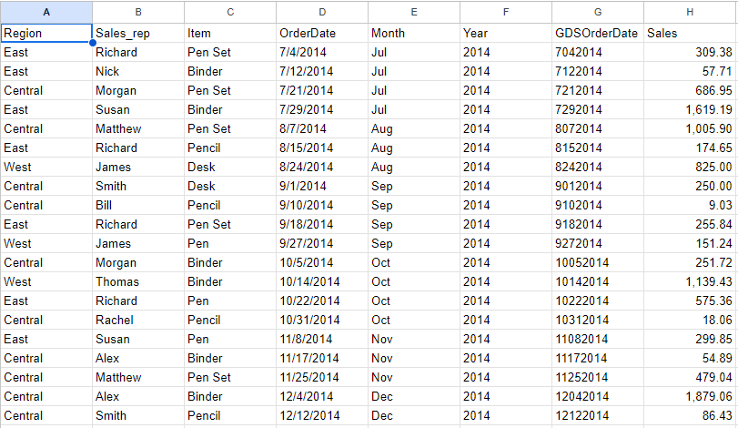
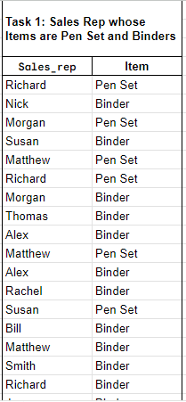
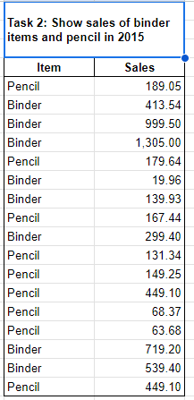
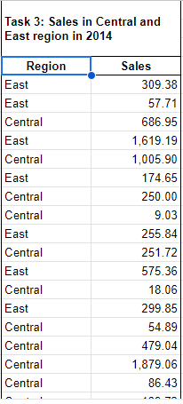
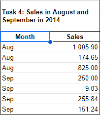
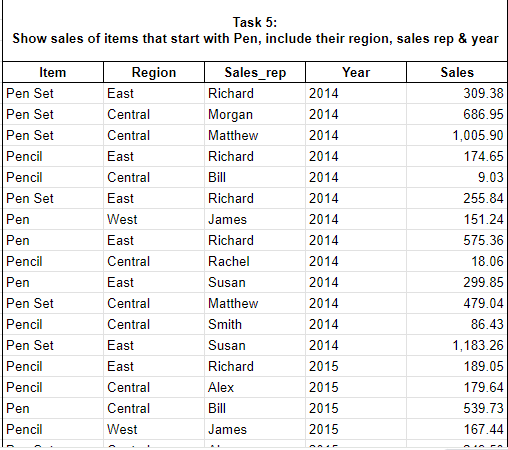
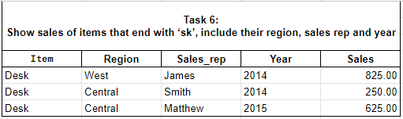
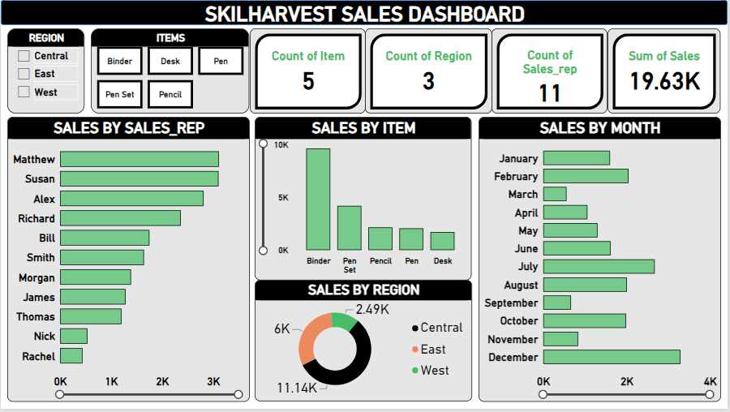
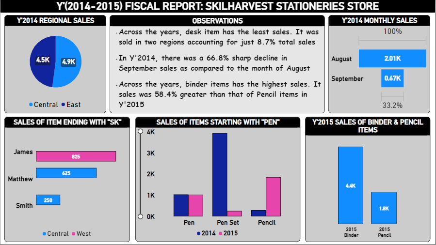
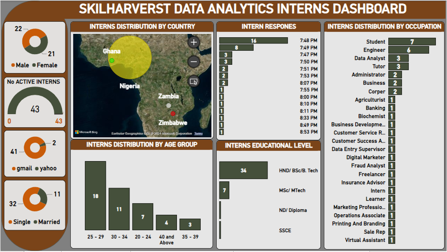

<div align="center">
  <table style="margin-left:auto; margin-right:auto; border-collapse: collapse">
    <tr>
      <td align="left" style="border: none">
        
      </td>
      <td align="center" style="border: none">
        <h1>SKILLHARVEST DATA ANALYSIS BOOTCAMP</h1>
      </td>
    </tr>
  </table>
</div>


## INTRODUCTION
This repository is an archive of my learning journals during the data analysis training bootcamp with SkillHarvest Academy. Below, is a curated list of the bootcamp contents:
1. Speadsheets Fundamentals (Microsoft Excel & Google Sheets) - [Download Here](https://www.microsoft.com)
2. Github Fundamentals - [Create Your Account](https://github.com/)
3. PowerQuery - [Download Here](https://www.bing.com/ck/a?!&&p=1e37fcbc5a9a0c62JmltdHM9MTcwNzM1MDQwMCZpZ3VpZD0wMGU2MGU2ZC0wY2QwLTYzYmQtMDcxMi0xZGQ3MGRjZDYyZjkmaW5zaWQ9NTQ3Mw&ptn=3&ver=2&hsh=3&fclid=00e60e6d-0cd0-63bd-0712-1dd70dcd62f9&psq=power+query+download&u=a1aHR0cDovL3d3dy5vZmZpY2UubWljcm9zb2Z0LmNvbS9leGNlbC9kb3dubG9hZC1taWNyb3NvZnQtcG93ZXItcXVlcnktZm9yLWV4Y2VsLUZYMTA0MDE4NjE2LmFzcHg&ntb=1)
4. Introduction to PowerBI - [Have a Glimpse Here](https://www.youtube.com/watch?v=fnA-_iDV_LY&list=PLoyECfvEFOjaMKFbBSKSmnOpEcXqqRegW)
5. Capstone Project 1: [Download Presentation Slide](https://docs.google.com/presentation/d/1hi_Z7c0v6xgI5BJ28VIZEHYDwbsxOoARtKH0aU4lLuE/edit#slide=id.g2bde3e191d5_3_159)
6. PowerBI DAX Expressions, Measures & Dimensions - [Have a Glimpse Here](https://www.youtube.com/watch?v=Ar6hSITP-w4&t=2038s)

## 1.0 SPREADSHEETS FUNDAMENTALS
Spreadsheets are powerful tools used for organizing, analyzing, and presenting data in a structured format. They consist of rows and columns, forming a grid where data can be entered, manipulated, and calculated.

They play a crucial role in various aspects of business, education, and personal organization. Hence, understanding their features and capabilities can significantly enhance productivity and decision-making processes.

- **Major types:** Microsoft Excel & Google sheet
- **Key features:** Organization, Calculations, Data analysis, Visualization & Collaboration
- **Common uses:** Financial management, Data tracking, Analysis & Reporting, and Decision making
- **Differences:**

<div align="center">
  
| Feature | Microsoft Excel | Google sheet |
|---------|-----------------|--------------|
|Ownership|Requires installation  & licenses|Cloud-based, accessible online|
|Cost|Paid software, licenses required|Free basic features, paid options|
|Functionalities|Advanced data analysis tools|Basic to intermediate capabilities|
|Collaboration|Limited collaboration features|Robust real-time collaboration capabilities|

</div>

## 2.0 GITHUB FUNDAMENTALS
**A.** Here, we were introduced to Github as a/an:
  - Version control & Collaboration Tool
  - Open source
  - Learning resources
    
**B.** How to create a Github account

**C.** How to create a repository

**D.** How to develop a Github project readme file
  
## 3.0 POWER QUERY
Here, we used **SkillHarvest_Stationary_Supplies.csv** to demonstrate the use cases of some power query functions. Below is an excerpt from the datasheet.

# <p align="center"/> **Excerpt From The Datasheet** </p>
<div align="center">
  
</div>


## 3.1 POWER QUERY EXERCISES
1. Show sales Rep whose Items are Pen Set and Binders
2. Show sales of binder items and pencil in 2015
3. Show sales in Central and East region in 2014
4. Show sales in August and September 2014
5. Show sales of items that start with Pen, include their region, sales rep and year.
6. Show sales of items that end with ‘sk’, include their region, sales rep and year

## <p align="center"/> TASK ONE SOLUTION </p>
```
PowerQuery
=QUERY(A1:H44, "SELECT B,C WHERE C='Pen Set' OR C='Binder'",1)
```
<div align="center">
  
</div>

## <p align="center"/> TASK TWO SOLUTION </p>
```
PowerQuery
=QUERY(A1:H44, "SELECT C,H WHERE (C='Binder' OR C='Pencil') AND F='2015'",1)
```
<div align="center">
  
</div>

## <p align="center"/> TASK THREE SOLUTION </p>
```
PowerQuery
=QUERY(A1:H44, "SELECT A,H WHERE (A='Central' OR A='East') AND F='2014'",1)
```
<div align="center">
  
</div>

## <p align="center"/> TASK FOUR SOLUTION </p>
```
PowerQuery
=QUERY(A1:H44, "SELECT E,H WHERE (E='Aug' OR E='Sep') AND F='2014'",1)
```
<div align="center">
  
</div>

## <p align="center"/> TASK FIVE SOLUTION </p>
```
PowerQuery
=QUERY(A1:H44, "SELECT C,A,B,F,H WHERE C LIKE 'Pen%'", 1)
```
<div align="center">
  
</div>

## <p align="center"/> TASK SIX SOLUTION </p>
```
PowerQuery
=QUERY(A1:H44, "SELECT C,A,B,F,H WHERE C LIKE '%sk'", 1)
```
<div align="center">
  
</div>

## 4.0 INTRODUCTION TO POWERBI
Here, we were familairized with PowerBI interface and dwells more on the processes of transforming data. We made use of two different datasets for class practices. However, I further created three stunning dashboards out of these datasets. You can find them below:

## <p align="center"/> SALES DASHBOARD: SKILHARVEST STATIONERIES</p>
<div align="center">  </div>


## <p align="center"/> 2014-2015 FISCAL REPORT FOR SKILHARVEST STATIONERIES: In response to PowerQuery Exercises </p>
<div align="center">  </div>

## 5.0 CAPSTONE PROJECT 1: TEAM DATACRUISERS
Here, I was the team lead of team of 9 and we were saddled to undertake a data analytics project. The project entails an in-depth analysis of demographic and professional data collected from participants enrolled in the SkilHarvest Bootcamp 2023-2024.

Through surveys conducted via Google Forms, key information such as name, email address, age group, occupation, state of residence, gender, and highest level of education was gathered. The objective is to extract meaningful insights and trends from the dataset, shedding light on the profiles and characteristics of data analytics interns. By employing advanced analytical techniques, the project aims to provide valuable insights for program improvement and participant engagement strategies.

I have created a separate GitHub project for this particular exercise. You can find it [Here](). You can also delve into a glimpse of the project dashboard below:

<div align="center">  </div>


## 6.0 POWERBI DAX EXPRESSIONS, MEASURES & DIMENSIONS
This was the crux of the SkilHarvest data analytics bootcamp. We dived into an exciting dataset from the HR industry where we were introduced to DAX functions. We created a number of measures and dimensions that assisted our insights from the data. I have created a separate GitHub project for this particular exercise. You can find it [Here]()
